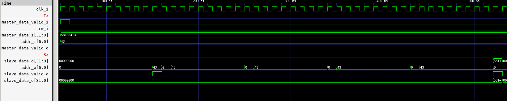
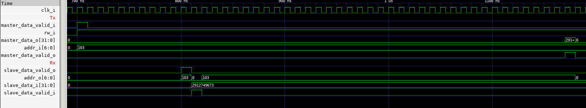

# I2C - Inter Integrated Circuit

I2C - Inter Integrated Circuit is is a synchronous, multi-master/multi-slave, single-ended, serial communication bus, widely used for attaching lower-speed peripheral integrated circuits (ICs) to processors and microcontrollers in short-distance, intra-board communication. 

*Source : [Wikipedia](https://en.wikipedia.org/wiki/I2C)*

## Wave Diagram

### Write :

    Fig 1: Write operation. Writing value 'd58188413 to Address 'd43.

### Read :

    Fig 1: Read operation. Reading value 'd2912749673 from Address 'd103.

## Specification

[Read here](https://www.nxp.com/docs/en/user-guide/UM10204.pdf)